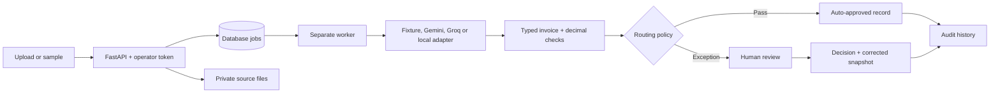

# Folio

**Invoice extraction with independent verification and an auditable human review workflow.**

Folio is a working agency demo and integration foundation. A model proposes invoice
data; Python checks the arithmetic and routing policy; an operator resolves exceptions.
The original extraction survives every review decision.

## Try it locally

The current workspace is already installed and built. Open VS Code's **Terminal → Run
Task → Folio: start demo**, or run:

```sh
.venv/bin/python scripts/dev.py
```

Open **http://127.0.0.1:8000**. The local demo token is `local-demo-only`.
Stop the API and worker together with Ctrl-C. Do not run a second copy on port 8000.
This machine uses ignored `.tools` links to the bundled Node/pnpm runtimes. Open a new
VS Code terminal to pick up that PATH; the Python interpreter is `.venv/bin/python`.

For a fresh checkout, install Python 3.12+, Node 24, and pnpm 11.19.0, then:

```sh
python3 -m venv .venv
.venv/bin/python -m pip install -r requirements.lock
cp .env.example .env
pnpm --dir web install --frozen-lockfile
pnpm --dir web build
.venv/bin/python scripts/dev.py
```

The startup script applies migrations, starts the database-backed worker, and serves
the compiled console through FastAPI. SQLite and private local files make the demo
usable without Docker, cloud accounts, or a model key. Fonts ship with the frontend.

## Three honest demonstrations

| Sample | Expected behavior |
| --- | --- |
| Clean invoice | Two pages, complete evidence, all arithmetic checks pass; automatic approval. |
| $50 discrepancy | Printed total is 1300.00, calculated total is 1250.00; human review. |
| Uncertain date | Arithmetic passes, fixture date confidence is 0.62; human review. |

These are explicitly labeled **synthetic fixtures**, including their confidence values.
They exercise real persistence, verification, routing, and review. They are not live
model results or an extraction-accuracy benchmark. Arbitrary uploads never receive
canned extraction data: in fixture mode they fail with `LIVE_PROVIDER_NOT_CONFIGURED`.

## Live extraction with your free-tier provider

The current rehearsal uses **Groq Qwen 3.8 27B**, with explicit local recovery on
availability errors. See [rehearsal notes](docs/REHEARSAL.md) for measured results,
recording instructions, and quota limitations. Run `.venv/bin/python scripts/preflight.py`
before recording; it makes no cloud inference call.

```dotenv
PROVIDER=groq
GROQ_API_KEY=your-key
GROQ_MODEL=qwen/qwen3.8-27b
LOCAL_FALLBACK_ENABLED=true
```

Groq uses image inputs and JSON mode, followed by strict local Pydantic validation.
This model accepts up to **three pages per request**; Folio rejects excess pages
before inference and shows the limit in the console. JSON mode alone does not
guarantee the extraction schema. Free-tier quotas still apply; do not submit a rapid
batch immediately before recording. See [Groq vision documentation](https://console.groq.com/docs/vision).

For real inference without an API quota, see [local Ollama setup](docs/LOCAL_INFERENCE.md).
Local mode keeps extraction on this machine and is clearly separate from offline fixtures.

The Gemini adapter is opt-in. Set these values in your untracked `.env` and restart:

```dotenv
PROVIDER=gemini
GEMINI_API_KEY=your-key
GEMINI_MODEL=your-currently-available-vision-model
```

Select a model supported by your account's free tier. Availability, quotas, and data
handling terms depend on the provider; Folio does not provision or enforce a free
billing tier. The adapter uses Google's
[generateContent API](https://ai.google.dev/api/generate-content) with image inputs,
a JSON schema, one cloud attempt per job, and local Pydantic validation. Its contract is tested
using mocked responses. Gemini `gemini-3.6-flash` was also checked with 11 local
evaluation inputs on 2026-09-16; see [live evaluation](docs/LIVE_EVALUATION.md).
The saved alternative is now `gemini-3.1-flash-lite` with
`GEMINI_THINKING_LEVEL=minimal`, tested on the challenge invoice on September 18.

Local fallback is opt-in and requires the Ollama server to be running. Upload audit
events pin consent. Only availability failures permit fallback; invalid extractions
or bad arithmetic do not. The UI shows the actual provider, and the failed cloud
attempt remains auditable. There is no silent cloud-to-cloud substitution.

Unknown live cost is `null`, never a fabricated zero. Fixture cost is explicitly zero
because there is no API call. Confidence is a model heuristic, not a calibrated
probability. Page citations are review aids, not independently verified provenance.

## How it works



- **Domain:** `app/domain` contains typed schemas, arithmetic, and pure routing policy.
- **Intake:** content sniffing, extension checks, file/page/pixel limits, private generated
  storage keys, and idempotency keys. Uploads return 202 with a persisted job ID.
- **Worker:** conditional database updates claim jobs. Terminal results are not replayed.
  Attempts interrupted for more than ten minutes fail visibly; retries after uncertain
  provider outcomes are not automatic. Exactly-once provider billing is not promised.
- **Verification:** line calculations, subtotal, and total use `Decimal` and explicit
  rounding. Missing amounts do not become zero. USD/EUR/GBP are supported in v1.
- **Review:** corrections and mandatory notes produce a separate decision snapshot.
  Human approval can explicitly accept remaining discrepancies; the checks stay visible.
- **Telemetry:** recorded provider usage, processing latency, policy reasons, health
  endpoints, and JSON worker logs without source text.

The relational model keeps immutable extraction/check JSON inside each job aggregate;
review decisions and audit events are separate related tables. This intentionally
simplifies the SRS's more normalized reference design for a small demo.

## API

Interactive documentation: **http://127.0.0.1:8000/docs**. Use its **Authorize** button
with the operator token. All `/api/v1` routes and source images require authentication.

| Method | Endpoint | Purpose |
| --- | --- | --- |
| POST | `/api/v1/documents` | Multipart upload; requires `Idempotency-Key` header |
| POST | `/api/v1/samples/{clean\|variance\|uncertain}` | Explicit synthetic fixture |
| GET | `/api/v1/jobs` | Latest 100 records and effective reviewed summaries |
| GET | `/api/v1/jobs/{id}` | Original extraction, checks, usage, and status |
| GET | `/api/v1/jobs/{id}/pages/{page}` | Authenticated source-page preview |
| GET | `/api/v1/review-tasks` | Pending review, failures first, oldest first |
| POST | `/api/v1/review-tasks/{id}/decision` | Approve/reject with note and optional corrected invoice |
| GET | `/api/v1/jobs/{id}/audit` | Original and review events |
| GET | `/api/v1/jobs/{id}/decision` | Corrected snapshot and recalculated checks |
| GET | `/api/v1/metrics` | Counts, review/failure rates, and processing latency percentiles |
| GET | `/health/live`, `/health/ready` | API liveness; database/storage/worker readiness |

## Development and verification

```sh
.venv/bin/python -m pytest -q
.venv/bin/ruff check .
.venv/bin/ruff format --check .
.venv/bin/python -m app.evaluate
pnpm --dir web build
```

For frontend hot reload, run `pnpm --dir web dev` alongside the API and worker.
Vite proxies API traffic to port 8000. VS Code tasks and extension recommendations
are included. CI runs the Python checks, migration, offline evaluation, and frontend build.

Tests cover invalid documents, decimal tolerance, incomplete fields, false confidence,
review history, duplicate decisions, idempotency, provider schema failures, transient
errors, interrupted jobs, source retention, and redacted API errors.

## Deployment foundation

`compose.yaml` provides PostgreSQL, migration, API, and worker services with shared
private source storage. Set a strong `OPERATOR_TOKEN` and `POSTGRES_PASSWORD` in `.env`,
then run `docker compose up --build`. Ports bind to localhost by default. Docker was
not available on the development machine, so this path is supplied but not executed.

For a client deployment, add the client's identity/tenant isolation, managed storage,
TLS, rate limiting, monitoring, backups, and provider data-processing agreement.
The demo token is public and unsuitable for a shared environment. PDFs render in the
worker process; hostile public intake needs stronger process/resource isolation.

Source retention defaults to seven days. Preview expiration without deleting anything:

```sh
.venv/bin/python -m app.retention
```

`--apply` permanently deletes expired source files and records an audit event. It does
not delete extraction/review records; define a separate client data-erasure policy.
Schedule that command in your deployment if automatic expiration is required.

## Sales handoff

See [the live document pack and Loom plan](docs/DEMO_PACK.md),
[the offline demo script](docs/DEMO.md), [verification report](docs/ACCEPTANCE.md),
[SRS](SRS.md), and [build plan](BUILD_PLAN.md).

